<div align="center">

# 🔍 ChatLens

### Local, evidence-grounded WhatsApp analysis — relationship insights and a Communication Coach on the roadmap

*Ask questions in plain English. Inspect the evidence behind answers. Designed for local analysis.*


</div>

---

## 📑 Table of Contents

- [✨ Overview](#-overview)
- [🚦 Project Status and Scope](#-project-status-and-scope)
- [🎯 Key Features](#-key-features)
- [🏗️ System Architecture](#️-system-architecture)
- [🔄 Data Ingestion Pipeline](#-data-ingestion-pipeline)
- [🧭 Query Routing](#-query-routing)
- [🧠 The RAG Graph](#-the-rag-graph)
- [🔎 Hybrid Retrieval Engine](#-hybrid-retrieval-engine)
- [🪟 Smart Context Expansion](#-smart-context-expansion)
- [🗄️ Data Model](#️-data-model)
- [📊 Analytics Dashboard](#-analytics-dashboard)
- [🧩 Planned Relationship and Communication Intelligence](#-planned-relationship-and-communication-intelligence)
- [🧱 Evidence Model and Claim Validation](#-evidence-model-and-claim-validation)
- [🛡️ Trust-Related Evidence: Design Principles](#️-trust-related-evidence-design-principles)
- [💬 Communication Coach](#-communication-coach)
- [🗺️ Implementation Plan](#️-implementation-plan)
- [🛠️ Tech Stack](#️-tech-stack)
- [📂 Project Structure](#-project-structure)
- [🚀 Getting Started](#-getting-started)
- [⚙️ Configuration Reference](#️-configuration-reference)
- [🧪 Testing & Diagnostics](#-testing--diagnostics)
- [🔐 Privacy & Responsible Use](#-privacy--responsible-use)
- [🗺️ Roadmap](#️-roadmap)

---

## ✨ Overview

**ChatLens** turns a raw WhatsApp `.txt` export into two things:

1. **A semantic Q&A interface** – ask things like *"What laptop was he considering buying?"* or *"How did our chats change after March?"* and get an answer grounded in retrieved messages, not a hallucinated guess.
2. **A behavioural insights dashboard** – sentiment trends, reply-time trends, conversation initiators and word frequencies, all computed with plain `pandas` statistics rather than invented by an LLM.

The documented workflow uses **[Ollama](https://ollama.com)** on your own machine, without requiring a hosted LLM API key or per-token API spend. Check your complete environment and dependencies before assuming that every component is fully offline.

> **Design principle:** *Chroma locates, SQLite remembers, the LLM reasons.*
> Vector search finds *where* to look, SQLite is the single source of truth for the full conversation, and the LLM should reason only over evidence that was actually retrieved. Answers still require evaluation: retrieval success alone does not guarantee that every generated claim is supported.

---

## 🚦 Project Status and Scope

ChatLens is being developed in stages. This README deliberately separates the existing RAG/analytics baseline from the relationship-analysis and coaching capabilities being designed next.

| Status | Meaning |
|---|---|
| ✅ **Existing baseline** | The capability is present in the current project structure or has passed a relevant local smoke test. Individual use cases can still have defects. |
| 🟡 **In progress / needs validation** | The capability exists, but reliability, end-to-end integration, or evaluation remains incomplete. |
| 🧭 **Planned** | Design target only. It should not be interpreted as already available in the UI or codebase. |

### Current validation snapshot

| Area | Status | Current understanding |
|---|---|---|
| WhatsApp parsing and enrichment | ✅ Existing baseline | Recent test parsed 8,312 messages and enriched 8,310; two system messages were excluded. |
| SQLite + FTS5 and dual Chroma retrieval | ✅ Existing baseline | Message-level, chunk-level, and lexical retrieval are part of the current architecture. |
| Duplicate message candidate guard | ✅ Smoke-tested | A recent run reported 27 candidates and 27 unique message IDs. This is an invariant check, not proof that every candidate is relevant. |
| Context display formatting | ✅ Recent test passed | A recent run showed normalized single headers in the context sent to the model. |
| Answer groundedness | 🟡 Needs validation | A real sports-question test returned `Grounded: False`; diagnose whether this is a genuine unsupported claim, a checker-input issue, or a response-parsing issue before changing the checker. |
| Relationship insights and Communication Coach | 🧭 Planned | The feature set, evidence schema, guardrails, and implementation sequence are documented below; they are not claimed as implemented. |

---

## 🎯 Key Features

| | Feature | What it does |
|---|---|---|
| 🧭 | **Deterministic query router** | Classifies each question into one of 8 intents (statistics, sentiment, context, …) with no LLM call |
| 🔀 | **Scope-aware routing** | Broad questions use a whole-chat profile; specific questions use retrieval |
| 🔎 | **Hybrid retrieval** | Combines message-level semantic search, chunk-level semantic search and SQLite FTS5 keyword search |
| 🧮 | **Evidence scoring** | Re-ranks candidates with semantic, lexical, term-coverage and multi-source signals |
| 🪟 | **Context expansion** | Grows each hit into a time-aware conversation window using real timestamp gaps |
| 🔁 | **Bounded query rewriting** | If retrieval comes back empty, the question is rewritten and retried (max 2 times) |
| 🟡 | **Groundedness check** | A second LLM pass evaluates support for generated answers; false rejections and claim-level behavior are still being validated |
| 📊 | **Deterministic analytics** | Trends and engagement stats are pure `pandas`, never LLM guesses |
| 🔒 | **100% local** | Ollama + ChromaDB + SQLite, all on disk |

---

## 🏗️ System Architecture

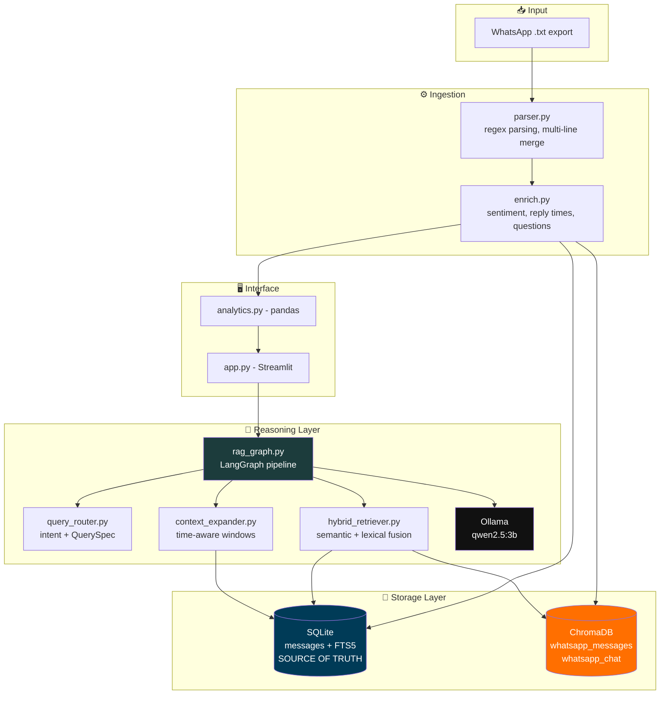

The diagram above describes the **current baseline**. The following is the **target architecture** for the new relationship and communication features; the dashed boundary represents work not yet implemented.

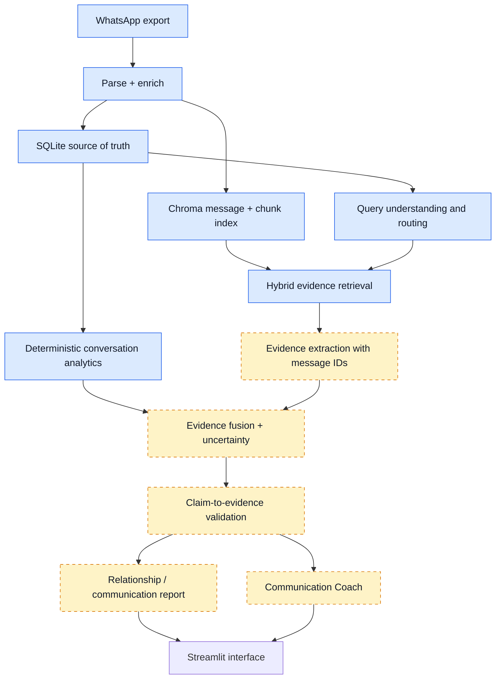

---

## 🔄 Data Ingestion Pipeline

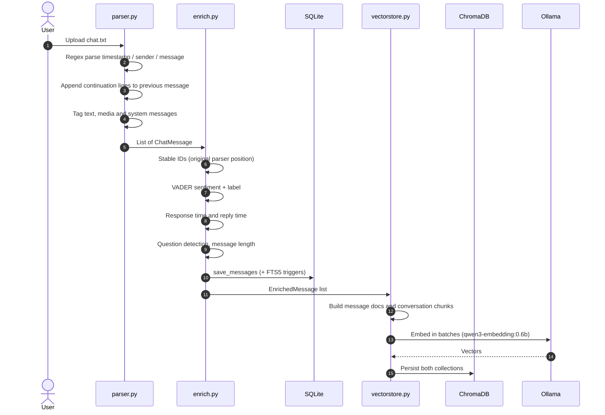

### Parsing

`parser.py` handles the common WhatsApp export variants:

```text
12/1/24, 9:03 AM - John: Hey, are we still on for lunch?     (Android, 12-hour)
1/12/2024, 21:03 - John: Hey there                            (24-hour)
[12/1/24, 9:03:12 AM] John: Hey there                         (iOS, bracketed)
```

- Optional brackets, optional seconds, optional AM/PM, hyphen **or** en-dash separators
- 12 date/time format fallbacks (`dd/mm` and `mm/dd`)
- Multi-line messages are merged into the preceding message
- System lines (no `sender:` split) are tagged `system` and excluded from analysis
- Over-long "sender" captures (> 60 chars) are rejected to avoid mis-parsing URLs or stray colons

### Enrichment

Every message gets:

| Field | Meaning |
|---|---|
| `id` | **Stable** position from the parser; never renumbered, so neighbours can always be found |
| `sentiment_compound` / `sentiment_label` | VADER compound score and its label |
| `is_question` | Whether the message is a question |
| `message_length` | Length of the message |
| `response_time_minutes` | Time since the immediately previous message |
| `reply_time_minutes` | Time since the last message from a *different* participant |

---

## 🧭 Query Routing

Before any retrieval happens, `query_router.py` deterministically classifies the question into an intent and extracts a structured `QuerySpec` (target, entities, answer type, constraints).

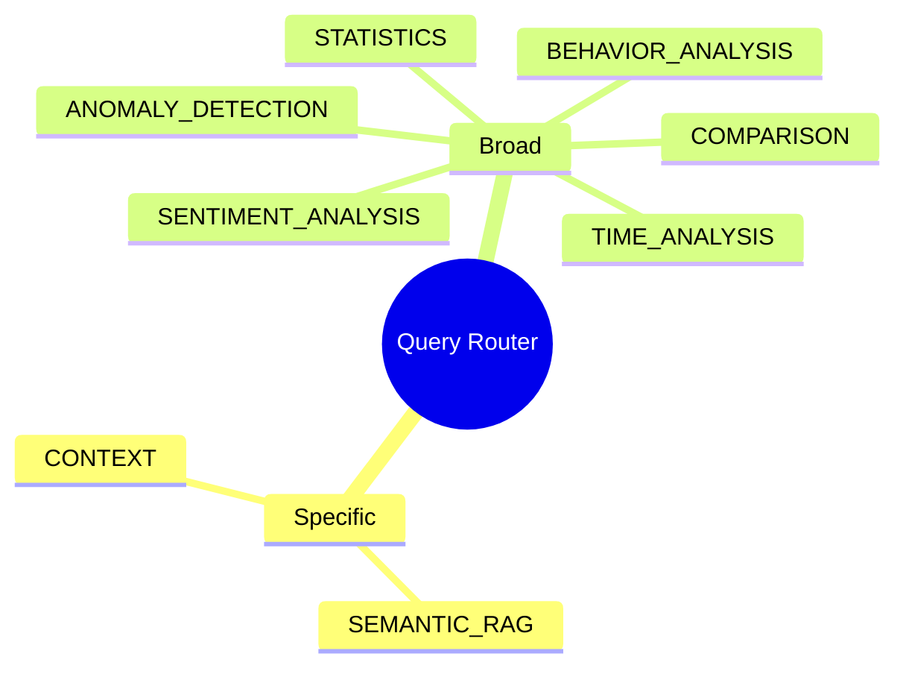

| Intent | Scope | Example question |
|---|---|---|
| `semantic_rag` | 🎯 Specific | *"What laptop was he thinking of buying?"* |
| `context` | 🎯 Specific | *"What was said around that argument?"* |
| `statistics` | 🌐 Broad | *"Who sends more messages?"* |
| `time_analysis` | 🌐 Broad | *"When are we most active?"* |
| `comparison` | 🌐 Broad | *"How do our reply speeds compare?"* |
| `behavior_analysis` | 🌐 Broad | *"How does each person usually respond?"* |
| `sentiment_analysis` | 🌐 Broad | *"Has the tone changed over time?"* |
| `anomaly_detection` | 🌐 Broad | *"Any unusual gaps or spikes?"* |

---

## 🧠 The RAG Graph

The heart of the project is a **LangGraph** state machine in `rag_graph.py`.

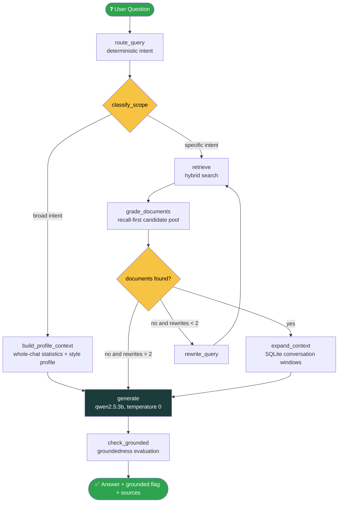

### Graph state

```python
class GraphState(TypedDict):
    question: str              # possibly rewritten
    original_question: str
    documents: List[Document]  # retrieved evidence
    generation: str            # the answer
    rewrite_count: int
    grounded: bool
    df: Optional[pd.DataFrame] # enriched data for broad analysis
    scope: str                 # "broad" | "specific"
    primary_intent: str
    secondary_intents: List[str]
    query_spec: Optional[QuerySpec]
```

### What `ask()` returns

```python
result = ask("Who is udit?", df=df)

result["answer"]         # the generated answer
result["grounded"]       # True / False from the groundedness check
result["sources"]        # evidence used
result["rewrites_used"]  # 0 to 2
result["scope"]          # "broad" | "specific"
result["query_spec"]     # structured parse of the question
```

> **Why `grade_documents` doesn't use the LLM:** retrieval is deliberately **recall-first**. A small model acting as a hard relevance filter can throw away useful evidence, so candidates are retained for generation. The separate groundedness check runs after generation, but its verdict is currently under validation; a `Grounded: True` result must not be treated as proof of correctness without evaluation.

---

## 🔎 Hybrid Retrieval Engine

`hybrid_retriever.py` fuses three independent retrieval signals and then **re-scores every candidate** with a deterministic, query-aware evidence score.

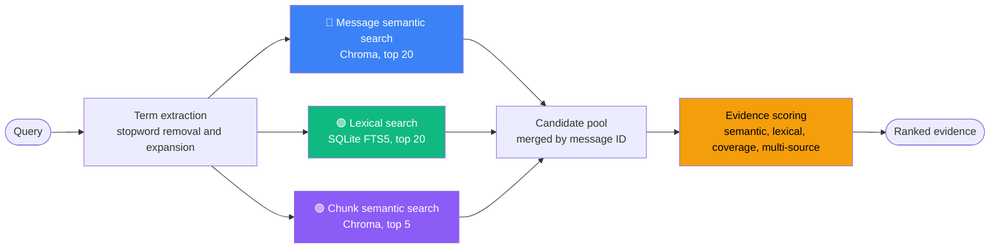

### Evidence score weights

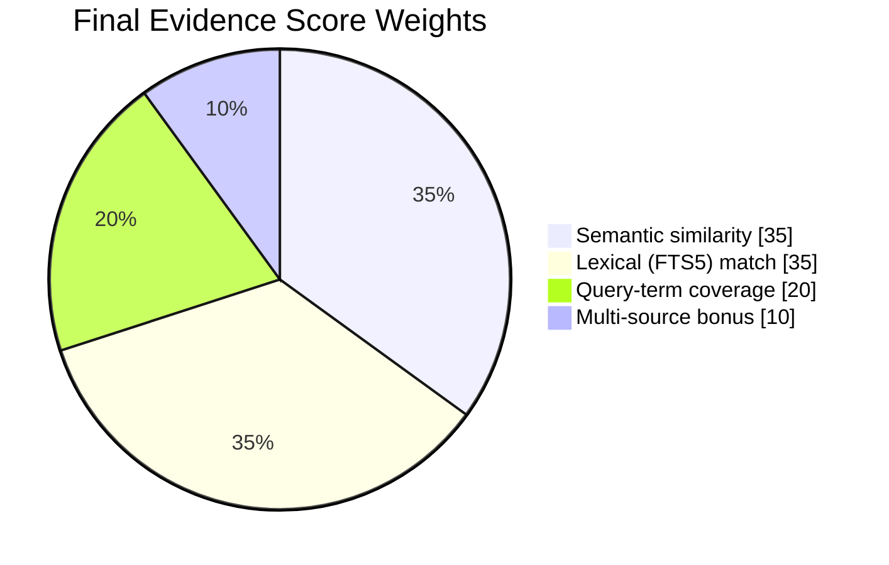

> A small additional message-quality term (`0.05`) down-weights low-information messages, and Reciprocal Rank Fusion (`k = 60`) is kept as *one* piece of evidence rather than the final ranker.

| Parameter | Value | Purpose |
|---|---|---|
| `MESSAGE_SEMANTIC_TOP_K` | 20 | Candidates from per-message embeddings |
| `LEXICAL_TOP_K` | 20 | Candidates from FTS5 keyword search |
| `CHUNK_TOP_K` | 5 | Candidates from conversation-chunk embeddings |
| `RRF_K` | 60 | Reciprocal Rank Fusion constant |

### Dual-level vector store

`vectorstore.py` maintains **two** Chroma collections so retrieval works at both a fine and a coarse level:

| Collection | Granularity | Best for |
|---|---|---|
| `whatsapp_messages` | One document per message | Precise facts, names, specific statements |
| `whatsapp_chat` | Conversation episodes | Topics, themes, "what did we discuss about…" |

**Chunking rules**

| Setting | Value |
|---|---|
| Episode gap (new episode after silence) | 120 min |
| Max messages per chunk | 50 |
| Overlap between chunks | 10 messages |
| Max characters per chunk | 6000 |
| Embedding batch size | 50 |

---

## 🪟 Smart Context Expansion

A single matching message is rarely enough to answer a question. `context_expander.py` grows each hit into a **conversation region** using actual timestamp gaps, not a fixed message count.

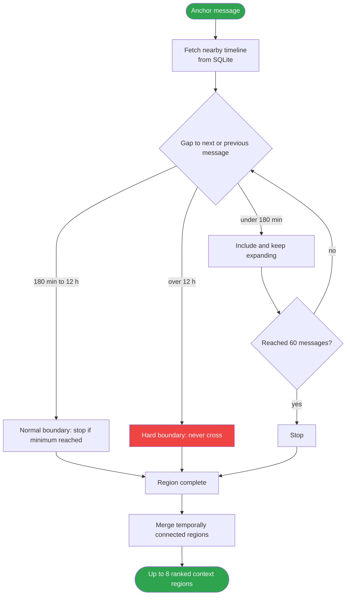

| Setting | Value | Meaning |
|---|---|---|
| `NORMAL_GAP_MINUTES` | 180 | A normal conversational pause |
| `HARD_GAP_HOURS` | 12 | Absolute boundary, never crossed |
| `MIN_CONTEXT_MESSAGES` | 5 | Minimum messages kept around an anchor |
| `MAX_CONTEXT_MESSAGES` | 60 | Cap on a single region |
| `MAX_REGIONS` | 8 | Maximum regions returned |
| `MAX_EMPTY_MESSAGES` | 3 | Blank or system-like messages tolerated in a row |

---

## 🗄️ Data Model

SQLite is the **single source of truth** for the full conversation. `messages_fts` is an FTS5 external-content index kept in sync by `INSERT` / `DELETE` / `UPDATE` triggers.

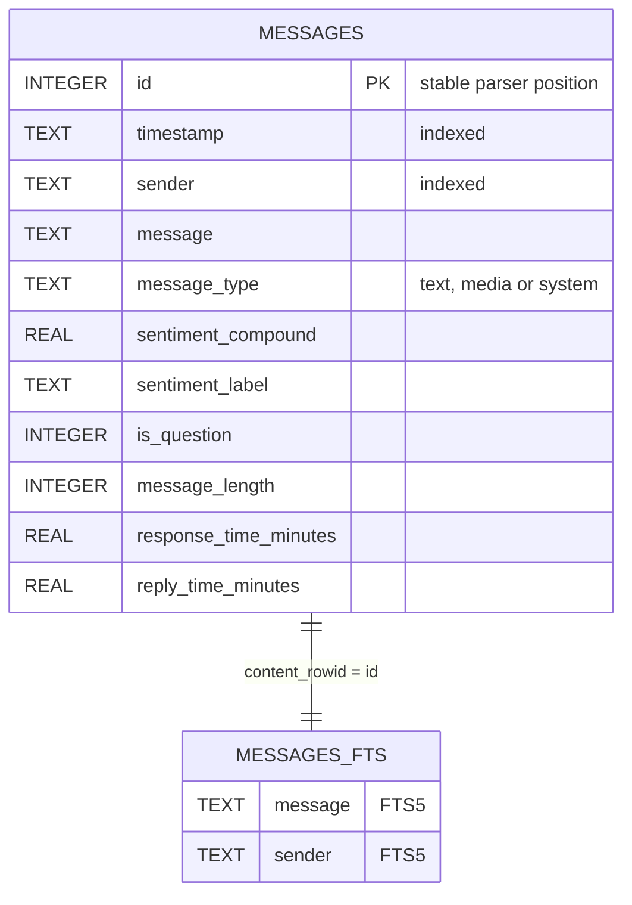

---

## 📊 Analytics Dashboard

The **Conversation Insights** tab is powered by `analytics.py`: deterministic `pandas` aggregations, with **no LLM-invented scores**.

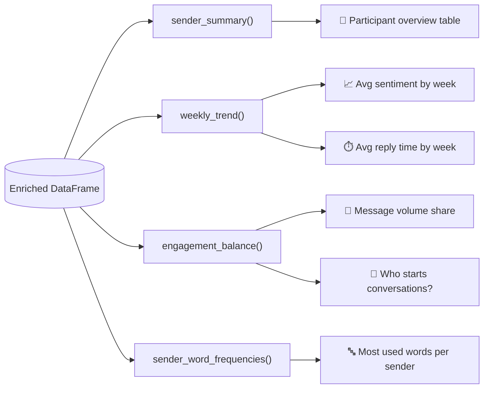

| Visual | Chart type | Metric |
|---|---|---|
| Participant Overview | Table | Message count, avg and median reply time, avg sentiment, question rate, avg message length |
| Average Sentiment by Week | Line | VADER compound score per week |
| Average Reply Time | Line | Mean reply time in minutes per week |
| Message Volume Share | Pie | Each sender's share of text messages |
| Who Starts Conversations? | Bar | Messages sent after a 3+ hour silence |
| Most Used Words | Bar | Top words per sender, with stopwords and WhatsApp noise removed |

---

## 🧩 Planned Relationship and Communication Intelligence

> 🧭 **Status: planned.** These are product goals and design constraints, not a claim that these features are already implemented. The existing parser, retrieval system, SQLite data, and analytics are the foundation on which they will be built.

The goal is to go beyond finding messages and descriptive charts while staying evidence-led. ChatLens should distinguish **what the chat explicitly shows**, **what may be a reasonable interpretation**, and **what cannot be concluded from text alone**.

### Planned feature map

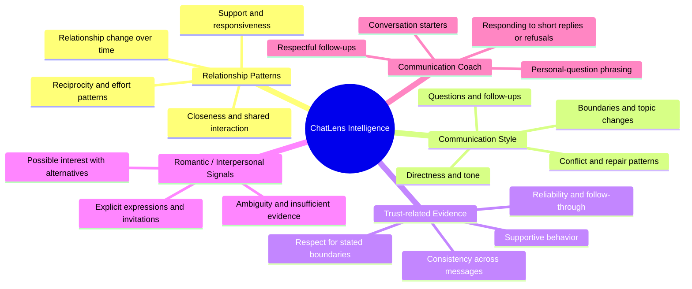

### Feature scope and how we intend to build it

| Planned capability | Intended output | Proposed implementation approach |
|---|---|---|
| Interpersonal relationship patterns | Evidence-backed descriptions of playful, supportive, professional, romantic, transactional, or acquaintance-like interaction patterns where the messages support that framing | Retrieve time-bounded examples; classify observable interaction acts; compare patterns over time; show alternatives and evidence IDs. Do not force every conversation into one relationship label. |
| Trust-related evidence | A profile of observed reliability, consistency, support, and boundary-respecting behavior relevant to a specified relationship context | Extract concrete behaviors, track supporting and contradicting examples, and report confidence and data coverage. Do not start with a universal numeric trust score. |
| Openness and boundaries | Examples of voluntary disclosure, topic limits, privacy concerns, requests, and responses to boundaries | Identify explicit disclosure/boundary language and what happened next. Treat privacy, silence, or refusal as a boundary—not automatically as distrust. |
| Communication style | Observable tendencies such as directness, question-asking, humor, reassurance, emotional language, and follow-up style | Use examples across time and participants. Describe communication behavior rather than diagnosing personality or assigning immutable traits. |
| Conflict and repair | Evidence of disagreement, escalation, apology, clarification, compromise, or attempted repair | Analyze the exchange in chronological context; distinguish jokes, ambiguity, and isolated messages from recurring patterns. |
| Reciprocity and effort | Balanced views of initiation, follow-ups, planning, support, and conversational contributions | Compute deterministic metrics from timestamps and message roles, then interpret them cautiously. Message counts alone cannot establish affection or effort. |
| Romantic interest indicators | Directly expressed interest, compliments, invitations, and other relevant excerpts—with uncertainty when evidence is indirect | Separate explicit statements from inferred signals; include alternative explanations. Never state private attraction as fact on the basis of ambiguous text. |
| Emotional closeness and relationship evolution | How observable communication patterns change across defined periods | Compare equivalent time windows and topic/context mix; use evidence snapshots and note missing or uneven data. Do not infer attachment from reply speed or disclosure alone. |
| Evidence-grounded relationship report | Structured findings with message IDs, dates, evidence for and against, confidence, and limitations | Combine deterministic analytics with a modular evidence extractor and a strict claim validator. Every substantive conclusion should link to source messages. |
| Communication Coach | Respectful draft wording, conversation openers, non-pressuring follow-ups, and ways to handle a short reply, topic change, or refusal | Generate options for a user-specified goal and tone; prioritize clarity, consent, and respect for boundaries. It must not coach manipulation, coercion, or persistence after a clear no. |

### Target relationship-analysis flow

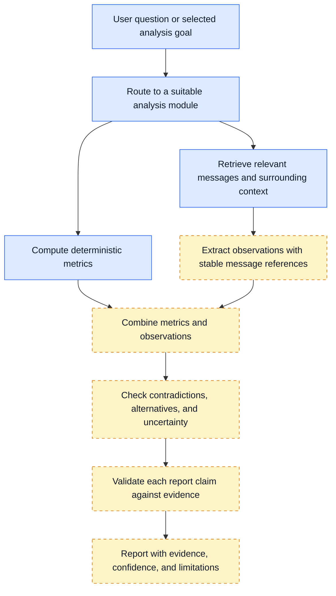

The new subsystem should remain modular. `rag_graph.py` should orchestrate the request, not become a single oversized prompt containing all psychological logic. Specialized modules should return structured evidence that can be tested independently.

---

## 🧱 Evidence Model and Claim Validation

> 🧭 **Status: design target.** The schema below is proposed for the planned intelligence layer; it is not yet a production database schema.

Every psychological or relationship-related interpretation should be represented as a traceable, reviewable observation rather than an unsupported label.

### Proposed evidence record

| Field | Purpose |
|---|---|
| `evidence_id` | Stable identifier for this extracted evidence item. |
| `message_ids` | One or more original message IDs supporting the observation. |
| `time_range` | Relevant date or period, so the report does not erase chronology. |
| `participants` | The people involved in the observable interaction. |
| `dimension` | A defined dimension such as reliability, support, openness, boundary respect, reciprocity, or conflict repair. |
| `observation` | A neutral description of what the message or sequence explicitly shows. |
| `evidence_direction` | `supports`, `contradicts`, or `neutral` with respect to a specific, clearly stated hypothesis. |
| `confidence` | Confidence in the extraction/interpretation, not certainty about someone's inner state. |
| `alternative_explanations` | Plausible non-exclusive interpretations that fit the same messages. |
| `coverage_limitations` | Missing context, incomplete export, ambiguous slang, media not included, or insufficient examples. |

### Observation → interpretation → report

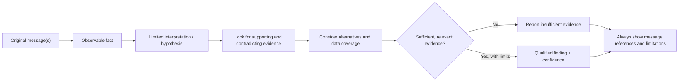

### Evidence quality rules

1. **Traceability:** every substantive report claim should link to one or more actual message IDs and timestamps.
2. **Separate fact from interpretation:** quote or summarize the observable behavior first; label interpretations as hypotheses.
3. **Include counter-evidence:** look for relevant contradictory examples instead of cherry-picking only confirming messages.
4. **Respect chronology:** one event should not silently become a stable long-term pattern; compare meaningful time windows.
5. **Calibrate uncertainty:** allow `insufficient evidence`; do not force a score or label if the data is weak.
6. **Preserve source wording:** slang, sarcasm, Hinglish, questions, requests, possibilities, and ambiguous statements must not be silently converted into confirmed events.
7. **No false precision:** confidence labels are not calibrated probabilities unless tested and calibrated against reviewed data.

### Evaluation before integration

Before these outputs become user-facing, build a manually reviewed evaluation set containing message IDs and expected interpretations. It should include explicit statements, questions versus events, requests versus completed actions, code-mixed text, sarcasm, ambiguous wording, contradictory evidence, privacy boundaries, and examples where the correct result is **insufficient evidence**. Measure extraction accuracy, evidence-reference validity, unsupported-claim rate, contradiction handling, and calibration before enabling any numeric score.

---

## 🛡️ Trust-Related Evidence: Design Principles

ChatLens should not treat trust as a single universal quality that can be read directly from a chat. The proposed scope is narrower: **observable evidence relevant to whether person A appears to regard person B as reliable within a specified relationship context**. Even this must be reported as an evidence-based interpretation, not as access to someone's private mental state.

### Candidate evidence dimensions

| Dimension | Potentially relevant observations | Important caveat |
|---|---|---|
| Reliability | Keeping commitments, following through, correcting missed commitments | A promise in chat is not proof that it was fulfilled; look for follow-up evidence. |
| Consistency / integrity | Statements that remain consistent across comparable contexts; clear corrections when details change | Different wording or changed plans are not automatically dishonesty. Context matters. |
| Benevolence / support | Offering practical help, checking in, responding to expressed needs | Support in a few messages does not define the whole relationship. |
| Openness | Voluntary sharing and direct communication about relevant topics | Disclosure is not a trust test. A person may reasonably keep information private. |
| Boundary respect | A request to stop, change a topic, or keep something private is acknowledged and respected | Asking a personal question does not automatically reduce trust. The wording, pressure, response to refusal, and later behavior matter. |
| Reciprocity | Initiation, follow-up, planning, listening, and support patterns over time | Equal message counts are not required, and asymmetry does not prove unequal affection. |

### Why no trust percentage at the start?

A Bayesian formulation such as `P(T | E)` can be considered later, but only after the construct `T` is explicitly defined and priors, likelihoods, dependence between observations, calibration, and evaluation procedures are justified. Repeated or correlated messages must not be counted as independent evidence merely to inflate confidence.

The first release should be an **evidence profile**, with supporting and contradicting examples, confidence labels, alternatives, and an explicit data-coverage statement. A numeric trust score is out of scope until it demonstrates validity on a reviewed evaluation set.

---

## 💬 Communication Coach

> 🧭 **Status: planned.** This is a writing and reflection aid, not a persuasion engine.

The Coach should help a user express themselves clearly and respectfully. It may use retrieved context to suggest phrasing, but it should not pretend to know what another person feels or recommend pressure tactics.

### Planned user journey

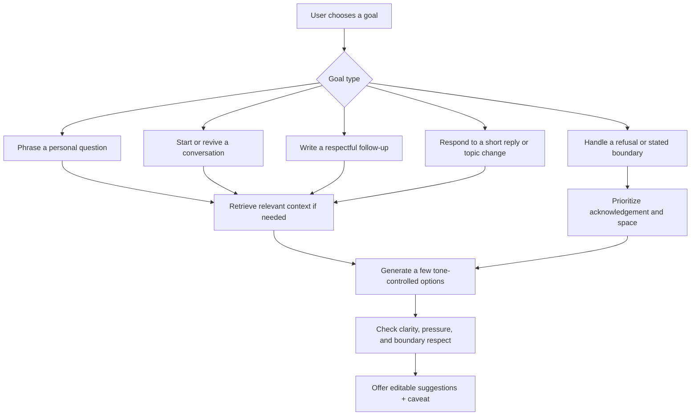

Expected behaviors:

- Offer options such as direct, warm, casual, or concise without changing the user's intent.
- Help turn a sensitive question into a low-pressure invitation that makes declining easy.
- Suggest a respectful follow-up when appropriate, but do not encourage repeated messages after a clear refusal or request for space.
- Treat a short reply or delayed reply as ambiguous; avoid asserting disinterest, attraction, anger, or attachment without explicit evidence.
- Keep user agency: present drafts for the user to edit, not instructions designed to manipulate another person.

---

## 🗺️ Implementation Plan

The proposed development sequence intentionally stabilizes the existing RAG system before adding interpretation-heavy features.

```mermaid
flowchart LR
    P0["Phase 0<br/>Stabilize RAG + grounding"] --> P1["Phase 1<br/>Define evidence schema"]
    P1 --> P2["Phase 2<br/>Create reviewed evaluation set"]
    P2 --> P3["Phase 3<br/>Build evidence extraction"]
    P3 --> P4["Phase 4<br/>Add deterministic analytics"]
    P4 --> P5["Phase 5<br/>Generate evidence-backed reports"]
    P5 --> P6["Phase 6<br/>Evaluate trust model"]
    P6 --> P7["Phase 7<br/>Build Communication Coach"]
    P7 --> P8["Phase 8<br/>Integrate with Streamlit"]

    classDef current fill:#dbeafe,stroke:#2563eb,color:#111827
    classDef next fill:#fef3c7,stroke:#d97706,color:#111827,stroke-dasharray: 5 5
    class P0 current
    class P1,P2,P3,P4,P5,P6,P7,P8 next
```

| Phase | Deliverable | Exit criteria |
|---|---|---|
| **0 — Stabilize existing pipeline** | Confirm normalized context, message-ID/chunk invariants, no fabricated candidate content, and accurate groundedness behavior | Regression tests pass; false rejection and unsupported-claim cases are understood. Do not weaken the checker to make examples pass. |
| **1 — Evidence schema** | Define dimensions, evidence direction, confidence, alternatives, message references, and insufficiency rules | Schema is documented and unit-tested independently of the UI. |
| **2 — Evaluation set** | Manually reviewed questions, evidence IDs, correct interpretations, counterexamples, and abstention cases | Every planned feature has positive, negative, ambiguous, and insufficient-evidence cases. |
| **3 — Evidence extraction** | Modular extractor outputs structured observations with source references | Source IDs exist, outputs parse to schema, and unsupported interpretations are measured. |
| **4 — Deterministic analytics** | Initiation, follow-up, response-time, reciprocity proxies, and time-window comparisons | Metrics have transparent definitions and tests; limitations are visible in results. |
| **5 — Relationship reports** | Reports that combine observations, metrics, counter-evidence, alternatives, and limitations | Every substantive claim has references and passes evaluation checks. |
| **6 — Trust model evaluation** | Evaluate whether a calibrated model is justified at all | No numeric trust score unless the construct, data, dependence, calibration, and failure modes are defensible. |
| **7 — Communication Coach** | Respectful drafts and conversation options | Tests cover refusals, stated boundaries, ambiguous replies, and non-manipulative wording. |
| **8 — UI integration** | Integrate new analysis goals into Streamlit | Clear status labels, source inspection, uncertainty display, and regression tests. |

---

## 🛠️ Tech Stack

| Layer | Technology |
|---|---|
| 🤖 LLM (generation, rewrite, groundedness) | [Ollama](https://ollama.com) · `qwen2.5:3b` |
| 🧬 Embeddings | `qwen3-embedding:0.6b` via Ollama |
| 🔗 Orchestration | LangChain · LangGraph |
| 🧲 Vector store | ChromaDB (persisted to `./chroma_db`) |
| 🗃️ Relational store + keyword search | SQLite + FTS5 (`./chat_data.db`) |
| 💭 Sentiment | VADER (`vaderSentiment`) |
| 📈 Analytics | pandas |
| 🖥️ UI | Streamlit · Plotly |

---

## 📂 Project Structure

```text
chatlens_v2/
│
├── app.py                 # Streamlit UI: Ask AI tab + Conversation Insights tab
│
├── parser.py              # WhatsApp .txt → structured ChatMessage records
├── enrich.py              # Stable IDs, sentiment, reply times, question flags
│
├── chat_database.py       # SQLite store + FTS5 search + context helpers
├── vectorstore.py         # Dual-level Chroma store (messages + chunks)
│
├── query_router.py        # Deterministic intent classification + QuerySpec
├── hybrid_retriever.py    # Semantic + lexical retrieval fusion and scoring
├── context_expander.py    # Timestamp-aware conversation windows
├── rag_graph.py           # LangGraph pipeline (route → retrieve → generate → verify)
├── analytics.py           # Deterministic pandas statistics
│
├── retrieval_test.py      # Retrieval diagnostics (no LLM)
├── hybrid_test.py         # Hybrid search smoke test
├── context_test.py        # Context expansion test
├── inspect_context.py     # Print raw messages around a given ID
├── test.py                # Embedding model sanity check
│
├── Requirements.txt       # Python dependencies
└── .gitignore
```

### Proposed future modules (not yet claimed to exist)

The names below are architectural suggestions for keeping the new features modular. They should only be added when their responsibilities and tests are ready.

```text
relationship_analysis/
├── evidence_schema.py          # Typed evidence records and validation
├── evidence_extractor.py       # Extract observations tied to message IDs
├── relationship_metrics.py     # Deterministic, tested metrics over time
├── evidence_fusion.py          # Supporting/contradicting evidence + alternatives
├── report_builder.py            # Evidence-backed report structure
├── trust_evidence.py            # Trust-related evidence profile; no default score
├── communication_coach.py       # Respectful draft options and boundary checks
└── evaluation/
    ├── cases.jsonl              # Manually reviewed questions and expected evidence
    └── run_evaluation.py        # Regression, grounding, and calibration metrics
```

---

## 🚀 Getting Started

### Prerequisites

- **Python 3.10+**
- **[Ollama](https://ollama.com/download)** installed and running (`http://127.0.0.1:11434`)
- ~4 GB of free disk space for the local models

### 1️⃣ Pull the models

```bash
ollama pull qwen2.5:3b
ollama pull qwen3-embedding:0.6b
```

### 2️⃣ Clone and install

```bash
git clone https://github.com/vVIBHORj/chatlens_v2.git
cd chatlens_v2

python -m venv venv
source venv/bin/activate        # macOS / Linux
venv\Scripts\activate           # Windows

pip install -r Requirements.txt
```

### 3️⃣ Export your WhatsApp chat

> **WhatsApp → open chat → ⋮ / contact name → More → Export chat → Without media**

Save the resulting `.txt` file somewhere on your machine.

### 4️⃣ Run the app

```bash
streamlit run app.py
```

Upload your `.txt` export in the sidebar, wait for indexing to finish, then:

- 💬 **Ask AI**: ask natural-language questions about the chat
- 📊 **Conversation Insights**: explore the analytics dashboard

### Using the pipeline from Python

```python
from parser import parse_whatsapp_export
from enrich import enrich_messages, to_dataframe
from rag_graph import ask

messages = parse_whatsapp_export("chat.txt")
enriched = enrich_messages(messages)
df       = to_dataframe(enriched)

result = ask("What did we discuss about sports?", df=df)
print(result["answer"])
print("Grounded:", result["grounded"])
```

> The vector store (`./chroma_db`) and SQLite database (`./chat_data.db`) must be built before calling `ask()`.

---

## ⚙️ Configuration Reference

Most behaviour is tuned with constants at the top of each module.

| File | Constant | Default | Effect |
|---|---|---|---|
| `rag_graph.py` | `MAX_REWRITES` | `2` | Max query-rewrite retries |
| `rag_graph.py` | `CONTEXT_BEFORE` / `CONTEXT_AFTER` | `10` / `10` | Messages added around each hit |
| `rag_graph.py` | `MAX_HYBRID_CANDIDATES` | `20` | Candidate pool size |
| `rag_graph.py` | `ChatOllama(model=…)` | `qwen2.5:3b` | Generation model |
| `vectorstore.py` | `EMBEDDING_MODEL` | `qwen3-embedding:0.6b` | Embedding model |
| `vectorstore.py` | `EPISODE_GAP_MINUTES` | `120` | Silence that starts a new episode |
| `vectorstore.py` | `PERSIST_DIR` | `./chroma_db` | Chroma location |
| `chat_database.py` | `DATABASE_PATH` | `./chat_data.db` | SQLite location |
| `hybrid_retriever.py` | `SEMANTIC_WEIGHT` / `LEXICAL_WEIGHT` | `0.35` / `0.35` | Evidence score weights |
| `context_expander.py` | `NORMAL_GAP_MINUTES` / `HARD_GAP_HOURS` | `180` / `12` | Conversation boundaries |

---

## 🧪 Testing & Diagnostics

These scripts help you debug each stage in isolation. Several need a built index and a running Ollama server.

```bash
python test.py              # embedding model sanity check
python retrieval_test.py    # message / chunk / lexical retrieval, no LLM involved
python hybrid_test.py       # end-to-end hybrid search on sample queries
python context_test.py      # context expansion behaviour
python inspect_context.py   # dump raw messages around specific message IDs
python parser.py chat.txt   # preview parsing output
```

> 💡 **Debugging tip:** if an answer looks wrong, run `retrieval_test.py` first. If the right messages aren't being *retrieved*, no amount of prompt tuning will fix the answer. Also inspect the groundedness checker separately: a recent sports-question run returned `Grounded: False`, so do not assume the checker is fully validated or make it more permissive merely to pass a single example.

---

## 🔐 Privacy & Responsible Use

- 🔒 **Designed for local processing.** Parsing, embeddings, retrieval and generation use local components in the documented setup. Verify your own environment and dependencies before making privacy guarantees.
- 🚫 **No hosted LLM API is required by the documented local workflow.** Do not assume every dependency or future integration is network-free without checking it.
- 🗂️ `chat_data.db`, `chroma_db/`, exports and `.env` files should remain ignored by Git. **Never commit raw conversations, generated reports, or evaluation examples containing private messages.**
- 🧾 Keep evidence references local and make it possible to inspect or remove indexed data.

> ⚠️ **ChatLens is a conversation-analysis aid, not a psychological, medical, or relationship diagnostic.** It cannot read minds or prove someone's intent, attraction, attachment, personality, or trust. Planned relationship features must describe observable text behavior, show supporting and contradicting evidence, include uncertainty and alternatives, and allow an `insufficient evidence` result. Privacy, refusal, silence, delayed replies, disclosure, and message volume must not be treated as standalone proof of distrust, disinterest, or affection. Analyze only conversations you have the right to process and follow applicable consent and privacy requirements.

---

## 🗺️ Roadmap

### Existing RAG baseline
- [x] Robust multi-format WhatsApp parser (existing baseline; keep regression coverage)
- [x] Dual-level Chroma index (messages + conversation chunks)
- [x] SQLite + FTS5 as source of truth
- [x] Deterministic 8-intent query router
- [x] Hybrid retrieval with evidence scoring
- [x] Timestamp-aware context expansion
- [x] Message-ID uniqueness invariant and normalized context headers smoke-tested
- [ ] Diagnose and improve groundedness-check accuracy without weakening the checker
- [ ] Align the Streamlit upload flow with the SQLite + dual-collection ingestion path
- [ ] Sidebar model labels read from config instead of hardcoded text
- [ ] Hinglish / code-mixed sentiment as an evaluated optional mode
- [ ] Streamed answers and source highlighting in the UI
- [ ] Automated retrieval-quality and answer-grounding evaluation set

### Planned relationship and communication features
- [ ] Define and test the psychological evidence schema
- [ ] Build a manually reviewed evaluation set with message IDs and insufficient-evidence cases
- [ ] Implement modular evidence extraction with source references
- [ ] Add deterministic relationship/communication metrics and time-window comparisons
- [ ] Generate evidence-backed relationship reports with contradictions and alternatives
- [ ] Evaluate trust-related evidence; defer any numeric score until calibration is justified
- [ ] Build the boundary-respecting Communication Coach
- [ ] Integrate new analysis modes into Streamlit with clear uncertainty and source inspection

---

<div align="center">

**Built with 🧠 LangGraph · 🦙 Ollama · 🧲 ChromaDB · 🗃️ SQLite · 🎈 Streamlit**

*If you find this useful, consider giving the repo a ⭐*

</div>